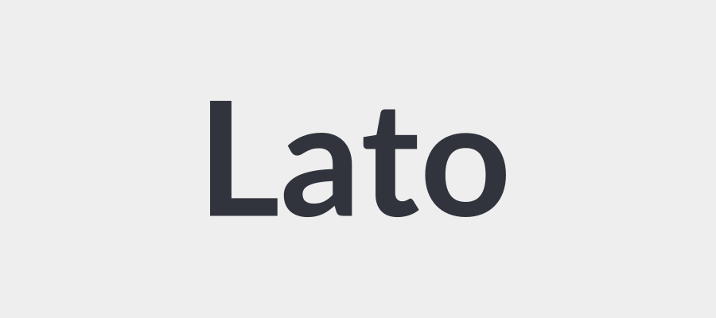

# Heading 1

Some introductory paragraph text. Now let's showcase some **formatting**.

## Heading 2

This is a paragraph containing *italicized text* and **bold text**. 

Here is a Markdown quote:

> This is a quote spanning multiple lines to see how the styles handle line wrapping and spacing. Did it look nice? What about code blocks below?

### Heading 3

Here comes an unordered list:

- First item[^2]
- Second item
- Third item

And now an ordered list:  

1. First item 
2. Second item
3. Third item

Including links is common:

Here is [a link to example.com](https://www.example.com).

An image would also be useful:  

{/*  */}

And code blocks of course:

```
Regular code blocks
  - Something
  - Something else
```

```python
# Python code example
x = 10
print(x) 
```

Adding a table:

| Column 1 | Column 2 | Column 3 |
|----------|----------|----------|  
| Row 1    | Data     | More data |
| Row 2    | 123      | 456 |

### Heading 3

Continuing text to simulate a full document and see how styling handles various components in combination over multiple sections.

## Heading 2

The last section to check is ~~strikethrough text~~ and horizontal rules:

---

***

## Heading with `Code`

Some intro text.

## Headings with the `<kbd>` element: <kbd>Ctrl</kbd> + <kbd>C</kbd> 

Press <kbd>Ctrl</kbd> + <kbd>C</kbd> to copy.

### Heading with **Bold** text

Remaining text.

## Emoji Support 😃

This paragraph contains an emoji to test emoji rendering: 😃

## Task Lists

- [ ] Incomplete task 
- [x] Completed task

## Definition Lists

CSS
: Cascading Style Sheets 

HTML
: HyperText Markup Language

## Abbreviations

The HTML specification is maintained by the W3C.

*[HTML]: Hyper Text Markup Language
*[W3C]: World Wide Web Consortium

## Strikethrough 

~~Mistaken text.~~

## Footnotes

Here is some text containing a footnote[^1].

[^1]: This is the footnote.
[^2]: This is the second footnote.